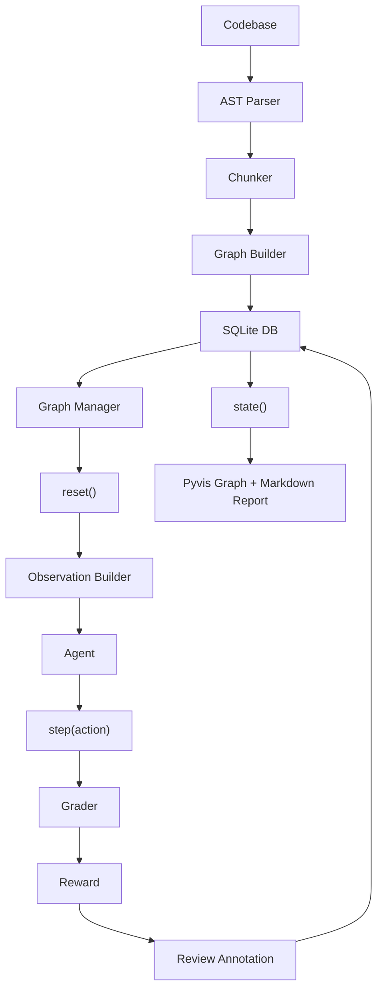

# NodeAudit — Graph-Aware Code Review RL Environment

## 1. Title + Badges


[](https://huggingface.co/spaces/Athmabhiram1/nodeaudit-openenv)


NodeAudit is an OpenEnv-compatible RL environment for dependency-aware code review where agents must reason about upstream causes before deciding downstream review actions.

Hugging Face Space: https://huggingface.co/spaces/Athmabhiram1/nodeaudit-openenv

## 2. Overview

NodeAudit simulates multi-file Python code review in a realistic setting where bugs and security risks propagate through imports and call paths. This is hard for AI agents because a local-looking defect in one module can be a symptom of a root cause in another module, and the agent must decide when to request context versus when to act under token limits. Unlike tools like CodeRabbit that review mostly in local diff context, this environment explicitly exposes dependency and dependent summaries so agents can reason about why a module behaves incorrectly before flagging it. A trained agent outputs structured review actions over episodes, then produces a fully annotated dependency graph with module-level review status, per-step rewards, and attribution links.

## 3. The RL Loop

### 3.1 Environment as MDP

Define the environment as an episodic MDP $(S, O, A, R, P)$.

- State space $S$: Persistent graph state in SQLite plus episode runtime (`episode_id`, task spec, module order/index, step counters, cumulative reward, grader state, and all persisted annotations). Concrete state payload is exposed via `GraphState` in `env/state.py`.
- Observation space $O$: `CodeObservation` from `env/observation.py`, token-budget constrained to `MAX_TOTAL_TOKENS=2000` by `graph/token_budget.py`, including current module code, AST summary, ranked dependency/dependent summaries, neighbor review snippets, available actions, optional requested context.
- Action space $A$: `ReviewAction` in `env/action.py` with `ActionType` in {`FLAG_STYLE`, `FLAG_BUG`, `FLAG_SECURITY`, `FLAG_DEPENDENCY_ISSUE`, `ADD_COMMENT`, `REQUEST_CONTEXT`, `REQUEST_CHANGES`, `APPROVE`, `AMEND_REVIEW`} plus typed fields (`target_line`, `content`, `attributed_to`, `context_request`).
- Reward function $R$: Deterministic reward reasons in `env/reward.py` mapped by `RAW_REWARD_TABLE` and emitted by graders (`easy`, `medium`, `hard`) through `ReviewReward`.
- Episode boundaries: `reset(task_id=...)` creates episode/module records and returns first observation. In `step()`, `done=True` when module list is exhausted or when `step_count >= max(task.max_steps, NodeAudit_MAX_STEPS_PER_EPISODE)`.

### 3.2 The Step Loop

```python
from env.environment import CodeReviewEnv

env = CodeReviewEnv(source_root="sample_project")
obs = env.reset(task_id="cascade_review")
done = False

while not done:
    action = agent.act(obs)  # agent decides action (must return ReviewAction)
    result = env.step(action)  # StepResult
    obs = result.observation
    reward = result.reward
    done = result.done
    # reward is computed by grader against deterministic analyzer-backed findings
    # obs includes updated context and prior persisted review annotations

graph_state = env.state()  # full episode+graph state snapshot
```

### 3.3 Why This Is Real RL

This is online interaction, not static scoring: each `step()` mutates persistent environment state and changes subsequent observations. Rewards are produced live by grader logic over action trajectories, not by one-shot offline label lookup. Ground truth findings are generated ahead of episodes by deterministic static analyzers and then consumed during policy interaction. The agent must learn a sequential policy over graph-structured observations under token budgets and episode step limits.

## 4. Architecture

### 4.1 System Diagram



### 4.2 Module Descriptions

| Module | File | Purpose | Key Functions | Connects To |
|---|---|---|---|---|
| AST Parser + Chunker | `parser/ast_parser.py`, `parser/chunker.py` | Parse Python modules, imports, signatures, constants; split large files into chunk nodes. | `parse_python_file(path, root_dir) -> ParsedModule`; `parse_directory(target_dir, db_path=None) -> Store`; `chunk_module(parsed, max_lines=300) -> ChunkResult` | `parser/graph_builder.py`, `db/store.py`, `db/seed.py` |
| Graph Builder | `parser/graph_builder.py` | Build explicit/implicit/intra-file/circular edges from parsed modules and chunks. | `build_edges(parsed_modules, module_ids, chunk_ids_by_parent) -> list[EdgeRecord]` | `db/seed.py`, `db/store.py` |
| Graph Manager + Token Budget | `graph/graph_manager.py`, `graph/token_budget.py` | Load/query graph from DB, compute centrality/traversal order, enforce token caps. | `load_graph(refresh=False) -> nx.DiGraph`; `centrality() -> dict[str, float]`; `traversal_order() -> list[str]`; `enforce(payload) -> BudgetResult` | `env/observation_builder.py`, `tasks/task_registry.py`, `graders/hard_grader.py` |
| DB Models + Seed | `db/models.py`, `db/schema.py`, `db/seed.py` | Define SQLModel schema; seed graph/nodes/edges/findings/analyzer runs. | `seed_project(target_dir, db_path=None, force=False) -> dict[str, object]`; `Store.upsert_node(...)`; `Store.upsert_edge(...)` | Parser, analyzers, environment, report generation |
| Observation Builder | `env/observation_builder.py` | Build `CodeObservation` with ranked neighbor context and token accounting. | `build(module_id, task_description, available_actions=None, context_request=None) -> CodeObservation` | `env/environment.py`, `graph/token_budget.py` |
| Action Space | `env/action.py` | Define validated action envelope and action enum. | `ActionType`; `ReviewAction.validate_required_fields(self) -> ReviewAction` | Environment step loop, graders |
| Reward Engine | `env/reward.py` | Define reward reasons, numeric table, normalization, typed reward records. | `normalize_reward(raw_value) -> float`; `make_reward(reason, feedback, ...) -> ReviewReward` | All graders, `env/environment.py` |
| Easy / Medium / Hard Graders | `graders/easy_grader.py`, `graders/medium_grader.py`, `graders/hard_grader.py` | Score actions against deterministic findings and graph attribution rules. | `grade_action(module_id, action, findings, state) -> ReviewReward`; `grade_episode(...) -> EpisodeGradeSummary` | `env/environment.py`, `db/store.py`, `graph/graph_manager.py` |
| Environment (step/reset/state) | `env/environment.py` | OpenEnv-style runtime orchestrating tasks, grading, persistence, and state snapshots. | `reset(...) -> CodeObservation`; `step(action: ReviewAction) -> StepResult`; `state() -> GraphState` | Tasks, graders, observation builder, store |
| FastAPI Server | `server/app.py` | HTTP API wrapper exposing health/tasks/reset/step/state/report/training endpoints. | `POST /reset`; `POST /step`; `GET /state`; `GET /health`; `POST /reports/generate` | `CodeReviewEnv`, `Store`, `visualizer/report_generator.py` |
| Pyvis Renderer + Report Generator | `visualizer/pyvis_renderer.py`, `visualizer/report_generator.py` | Generate JSON/Markdown/HTML artifacts and interactive graph visualization. | `render_graph_html(...) -> Path`; `generate_phase5_outputs(...) -> GeneratedArtifacts` | `server/app.py`, `run_project.py` |
| inference.py | `inference.py` | Deterministic training harness: seed, collect analyzer findings, compare agent outputs, persist training runs. | `main()`; `_extract_agent_findings(store, config) -> set[str]` | `db/seed.py`, `training/run_manager.py`, `training/weights.py` |

### 4.3 Database Schema

`db/models.py` re-exports SQLModel tables defined in `db/schema.py`.

| Table | Columns (name: type) |
|---|---|
| `ModuleNode` | `id:int?`, `source_root:str`, `module_id:str`, `name:str?`, `raw_code:str`, `ast_summary:str`, `summary:str?`, `linter_flags:str`, `parent_module_id:str?`, `is_chunk:bool`, `dependency_reason:str`, `review_annotation:str?`, `review_status:ReviewStatus`, `review_summary:str?`, `created_at:datetime`, `updated_at:datetime` |
| `ModuleEdge` | `id:int?`, `source_root:str`, `source_module_id:str`, `target_module_id:str`, `edge_type:EdgeType`, `import_line:str`, `weight:float`, `connection_summary:str` |
| `LinterFinding` | `id:int?`, `source_root:str`, `module_id:str`, `tool:str`, `line:int`, `severity:Severity`, `code:str`, `message:str` |
| `ReviewAnnotation` | `id:int?`, `source_root:str`, `module_id:str`, `episode_id:str`, `task_id:str?`, `step_number:int`, `action_type:str`, `note:str`, `reward_given:float`, `attributed_to:str?`, `is_amendment:bool`, `created_at:datetime` |
| `EpisodeRecord` | `id:int?`, `source_root:str`, `episode_id:str`, `task_id:str`, `module_id:str`, `total_steps:int`, `cumulative_reward:float`, `created_at:datetime` |
| `TaskDefinition` | `id:int?`, `source_root:str`, `task_id:str`, `task_level:str`, `target_module_id:str`, `description:str`, `ground_truth_ref:str` |
| `SeedMeta` | `key:str (PK)`, `value:str` |
| `AnalyzerRun` | `id:int?`, `source_root:str`, `analyzer:str`, `analyzer_version:str`, `status:AnalyzerStatus`, `findings_count:int`, `command:str`, `command_hash:str`, `error_message:str?`, `started_at:datetime`, `finished_at:datetime` |
| `AnalyzerFinding` | `id:int?`, `source_root:str`, `analyzer_run_id:int`, `analyzer:str`, `module_id:str`, `line:int`, `severity:Severity`, `rule_id:str`, `message:str`, `evidence:str`, `created_at:datetime` |
| `TrainingRun` | `id:int?`, `source_root:str`, `run_id:str`, `model_name:str`, `model_sha256:str`, `deterministic_findings:int`, `agent_findings:int`, `true_positives:int`, `false_positives:int`, `false_negatives:int`, `precision:float`, `recall:float`, `passed_non_regression:bool`, `output_path:str`, `run_config_json:str`, `created_at:datetime` |

### 4.4 Graph Construction

Chunking: modules with `<=300` lines stay whole; modules with `>300` lines are split into chunk nodes for each top-level `ClassDef`, `FunctionDef`, or `AsyncFunctionDef` (`parser/chunker.py`).

Edge types:

- `explicit_import`: module-level imports
- `implicit_dependency`: function-level imports
- `intra_file`: parent→chunk containment and function-call intra-file links
- `circular`: added when reciprocal directed edges are detected

Scope tagging: import scope is tagged as `module_level` or `function_level` during AST traversal in `parser/ast_parser.py` and propagated into edge records.

Traversal order: `graph/graph_manager.py` computes a leaf-first order using reversed `nx.lexicographical_topological_sort` for DAGs, with betweenness centrality used as a deterministic tie-break key; cyclic graphs fall back to sorting by out-degree then centrality.

## 5. Grader Architecture

### 5.1 Ground Truth Generation

At seed time, findings are generated deterministically and stored in SQLite:

- File-local linters (`parser/linter.py`): `pylint`, `bandit`, `pyflakes`
- Analyzer pipeline (`analyzers/pipeline.py`): `pylint`, `pyflakes`, `bandit`, `mypy`, `pyright`, `vulture`, optional `semgrep`

`ModuleNode.linter_flags` stores serialized module findings; normalized analyzer findings are persisted in `AnalyzerRun` and `AnalyzerFinding`. Agent observations do not expose these ground-truth rows directly. Graders score actions against stored findings and graph structure.

### 5.2 Easy Grader

- Checks: exact category match for `FLAG_STYLE`, `FLAG_BUG`, `FLAG_SECURITY` against findings, with `LINE_TOLERANCE = ±3`.
- Determinism: 100% deterministic, zero LLM calls.
- Expected baseline score range: approximately `0.5` to `2.0` raw for single-module easy episodes, depending on finding count and terminal action.

### 5.3 Medium Grader

- Adds over Easy: `ADD_COMMENT` keyword overlap scoring via Jaccard similarity (`KEYWORD_MIN_JACCARD = 0.3`) against finding `rule_id/message`, plus amendment handling (`AMEND_REVIEW`).
- Determinism: still zero LLM calls.
- Expected baseline score range: approximately `2.0` to `7.0` raw across multi-module medium episodes.

### 5.4 Hard Grader

- Stage 1 (implemented): deterministic graph consistency + hard-finding matching.
- Verifies `FLAG_DEPENDENCY_ISSUE` has valid `attributed_to` module and a graph edge in either direction.
- If a deterministic hard-stage finding matches, returns `CORRECT_DEPENDENCY_ATTRIBUTION`; if edge valid but no finding match, returns partial credit.
- Stage 2 (not implemented in current grader): LLM-as-judge.

> ⚠️ `graders/hard_grader.py` currently deterministic-only. It does not call an LLM judge, does not use a prompt hash, and does not implement a 0.0/0.5/1.0 rubric path.

- Expected baseline score range: approximately `3.0` to `8.0` raw for scripted deterministic hard episodes.
- Scope: hard grader rewards dependency attribution correctness over graph-grounded cascade reasoning; it is not pure bug-finding recall optimization.

### 5.5 Reward Table

Values from `env/reward.py` (`RAW_REWARD_TABLE`):

| Action | Condition | Reward |
|---|---|---:|
| `FLAG_STYLE` / `FLAG_BUG` / `FLAG_SECURITY` | Correct finding category + unmatched finding + line within tolerance (or no line provided) | `+0.5` |
| `ADD_COMMENT` | Medium/hard grader comment aligns to finding (`Jaccard >= 0.3`) | `+0.3` |
| `FLAG_DEPENDENCY_ISSUE` | Valid edge + matched hard finding | `+0.6` |
| `FLAG_DEPENDENCY_ISSUE` | Valid edge but no matched hard finding | `+0.35` |
| `FLAG_DEPENDENCY_ISSUE` | Missing/invalid attribution or no edge | `+0.1` |
| `AMEND_REVIEW` | Non-empty amendment content accepted by medium/hard | `+0.4` |
| `REQUEST_CONTEXT` | Any context request | `-0.1` |
| `FLAG_*` / `ADD_COMMENT` / `AMEND_REVIEW` | False positive / invalid | `-0.2` |
| `APPROVE` | Module has critical findings (`severity=high`) | `-1.0` |
| `REQUEST_CHANGES` | Module had no findings | `-0.3` |
| `APPROVE` or `REQUEST_CHANGES` | Valid episode/module completion decision | `+0.2` |
| Any no-impact action | No grading impact path | `0.0` |

## 6. Tasks

| Task ID | Difficulty | Input | Objective | Grader | Expected Baseline Score* | Failure Modes |
|---|---|---|---|---|---:|---|
| `style_review` | easy | Default module list `['cart']` (from `tasks/easy_task.py`) | Correctly flag lint/style/bug/security findings on focused module and terminate with `REQUEST_CHANGES`/`APPROVE` | `easy` | `0.8` | Wrong flag category, line mismatch beyond tolerance, premature `APPROVE` |
| `logic_review` | medium | Default `['checkout', 'auth']` expanded to direct neighbors via graph (`expand_to_dependencies=True`) | Use dependency context and accurate comments/amendments while flagging deterministic issues | `medium` | `6.5` | Low-overlap comments (`Jaccard < 0.3`), over-flagging, no final terminal action |
| `cascade_review` | hard | Default `['checkout', 'auth', 'config']` expanded to neighbors | Correctly attribute dependency issues to connected modules (`attributed_to`) and match deterministic hard findings | `hard` | `6.7` | Invalid `attributed_to`, no graph edge, unsupported attribution claims |

\* Baselines above were measured on `sample_project` using a deterministic scripted policy against current environment code.

## 7. Observation & Action Space

### 7.1 Observation Space

Full model definition from `env/observation.py`:

```python
from typing import Literal
from pydantic import BaseModel, ConfigDict, Field, field_validator
from graph.token_budget import MAX_TOTAL_TOKENS

class NeighborSummary(BaseModel):
    model_config = ConfigDict(strict=True, extra="forbid")
    module_id: str
    relation: Literal["dependency", "dependent"]
    summary: str
    review_snippet: str | None = None

class RequestedContext(BaseModel):
    model_config = ConfigDict(strict=True, extra="forbid")
    module_id: str
    code: str
    was_truncated: bool

class CodeObservation(BaseModel):
    model_config = ConfigDict(strict=True, extra="forbid")
    module_id: str
    code: str
    module_summary: str = ""
    ast_summary: dict[str, object]
    dependency_summaries: list[NeighborSummary] = Field(default_factory=list)
    dependent_summaries: list[NeighborSummary] = Field(default_factory=list)
    neighbor_reviews: list[str] = Field(default_factory=list)
    task_description: str
    available_actions: list[str] = Field(default_factory=list)
    requested_context: RequestedContext | None = None
    token_usage: dict[str, int]
    total_tokens: int
    within_budget: bool
```

Field semantics:

- `module_id`, `code`, `task_description`: current review target + textual objective.
- `ast_summary`: parsed summary payload from stored AST summary text.
- `dependency_summaries`, `dependent_summaries`: ranked neighbor context.
- `neighbor_reviews`: short prior review snippets from neighboring modules.
- `available_actions`: action names available this step.
- `requested_context`: optional code payload from `REQUEST_CONTEXT`.
- `token_usage`, `total_tokens`, `within_budget`: strict budget accounting.

Token budget from `graph/token_budget.py`:

| Component | Max Tokens | Source |
|---|---:|---|
| `current_code` | 800 | Current module code |
| `ast_summary` | 100 | Stored AST summary |
| `direct_deps` | 250 | Serialized dependency summaries |
| `dependents` | 150 | Serialized dependent summaries |
| `neighbor_reviews` | 120 | Prior neighbor review snippets |
| `task_and_actions` | 200 | Task description + action list |
| `requested_context` | 800 | Optional requested module code |
| Total hard cap | 2000 | `MAX_TOTAL_TOKENS` |

### 7.2 Action Space

Full model definition from `env/action.py`:

```python
from enum import StrEnum
from pydantic import BaseModel, ConfigDict, model_validator

class ActionType(StrEnum):
    FLAG_STYLE = "FLAG_STYLE"
    FLAG_BUG = "FLAG_BUG"
    FLAG_SECURITY = "FLAG_SECURITY"
    FLAG_DEPENDENCY_ISSUE = "FLAG_DEPENDENCY_ISSUE"
    ADD_COMMENT = "ADD_COMMENT"
    REQUEST_CONTEXT = "REQUEST_CONTEXT"
    REQUEST_CHANGES = "REQUEST_CHANGES"
    APPROVE = "APPROVE"
    AMEND_REVIEW = "AMEND_REVIEW"

class ReviewAction(BaseModel):
    model_config = ConfigDict(strict=True, extra="forbid")
    action_type: ActionType
    target_line: int | None = None
    content: str | None = None
    attributed_to: str | None = None
    context_request: str | None = None
```

When to use each action:

- `FLAG_STYLE`: low-severity style/lint issue candidates (`+0.5` on match, `-0.2` on miss).
- `FLAG_BUG`: medium/high logic/static-error candidates (`+0.5` on match, `-0.2` on miss).
- `FLAG_SECURITY`: security findings (typically `bandit`) (`+0.5` on match).
- `FLAG_DEPENDENCY_ISSUE`: hard-stage cascade attribution with `attributed_to` module (`+0.6`/`+0.35`/`+0.1`).
- `ADD_COMMENT`: explanatory comment aligned to findings (`+0.3` in medium/hard, else no-op or penalty).
- `REQUEST_CONTEXT`: fetch additional module code (`-0.1` cost).
- `AMEND_REVIEW`: adjust prior interpretation with explicit content (`+0.4` when valid).
- `REQUEST_CHANGES`: terminal review decision for problematic module (`+0.2` or `-0.3` on clean module).
- `APPROVE`: terminal clean decision (`+0.2`, but `-1.0` if critical issues exist).

## 8. Output — The Annotated Graph

End-of-run artifacts (default prefix from report generator is configurable):

- `NodeAudit_report.json`: machine-readable graph, findings, reviews, metrics.
- `NodeAudit_report.md`: module-by-module review narrative and attribution summary.
- `NodeAudit_graph.html`: interactive Pyvis dependency graph.

Visualization semantics from `visualizer/pyvis_renderer.py` and report generator:

- Node colors:
    gray `pending`, yellow/orange `in_progress`, green `approved`, red `changes_requested`
- Node size:
    `8.0 + 42.0 * betweenness_centrality`
- Edge colors:
    blue `explicit_import`, orange `implicit_dependency`, red `circular`, teal `intra_file`
- Click behavior:
    node click posts `NodeAudit-node-select` message with module id to parent UI for review panel sync.

Why this differs from CodeRabbit: annotations persist in the graph database, attribution links can cross modules, and output is a full codebase dependency map with review state rather than isolated PR comments.

## 9. Setup & Installation

### 9.1 Prerequisites

- Python `>=3.11` (from `pyproject.toml` and Docker base image)
- `pip`
- Docker (for containerized run)
- Optional CLI tooling installed by dependencies: `mypy`, `pyright`, `semgrep`, `vulture`, `pylint`, `bandit`, `pyflakes`

### 9.2 Local Setup

```bash
# Step 1: Clone
git clone https://huggingface.co/spaces/YOUR_USERNAME/NodeAudit-env
cd NodeAudit-env

# Step 2: Install dependencies
pip install -r requirements.txt
pip install -e .

# Step 3: Seed the database (parse codebase once)
python -m db.seed sample_project --force

# Step 4: Start server
uvicorn server.app:app --host 0.0.0.0 --port 8000

# Step 5: Verify
curl http://localhost:8000/health
curl -X POST http://localhost:8000/reset -H "Content-Type: application/json" \
  -d '{"task_id": "style_review"}'
```

### 9.3 Docker

```bash
docker build -t NodeAudit-env:latest .
docker run --rm -p 8000:7860 \
  -e API_BASE_URL=https://api-inference.huggingface.co/models/Qwen/Qwen2.5-Coder-7B-Instruct/v1 \
  -e MODEL_NAME=Qwen/Qwen2.5-Coder-7B-Instruct \
  -e HF_TOKEN=your_token \
  NodeAudit-env:latest
```

Verify with the same curl commands above, targeting `http://localhost:8000`.

### 9.4 OpenEnv Validation

```bash
pip install openenv-core
openenv validate
```

`openenv validate` checks OpenEnv metadata and endpoint contract compatibility (task metadata and environment API surface).

Observed command result in this environment:

```text
[OK] code-review-env: Ready for multi-mode deployment
```

If your local environment still resolves `openenv` to the unrelated `openenv==0.1.13` package, run this one-time fix:

```bash
pip uninstall -y openenv
pip install -e ../OpenEnv
openenv validate
```

## 10. Running Inference

```bash
export API_BASE_URL=https://api-inference.huggingface.co/models/Qwen/Qwen2.5-Coder-7B-Instruct/v1
export MODEL_NAME=Qwen/Qwen2.5-Coder-7B-Instruct
export HF_TOKEN=your_token_here

python inference.py sample_project
```

Real stdout format from current `inference.py` run:

```text
[START] target=/home/lightdesk/Downloads/Projects/NodeAudit/code-review-env/sample_project model=gemma4:e4b mode=deterministic-ground-truth
[STEP] weights_registered {"model": "gemma4:e4b", "sha256": "724b2b241230aad689f5b43fe8f22d452755bf98677fbcfaa36d2a1b6a89c140", "size_bytes": 6254198752}
[STEP] weights_verified path=/home/lightdesk/Downloads/Projects/NodeAudit/Models/Qwen2.5-Coder-7B-Instruct-Q6_K.gguf
[STEP] seeded {"codebase_hash": "0e4e86a3bf4dbeb45c0ca3d91c1ab6c2a511e21b5253370778975d8c0db78603", "edge_count": 57, "loaded_from_cache": true, "node_count": 60, "seeded": true}
[STEP] agent_llm_disabled reason=completion-failed error=JSONDecodeError module=checkout
[STEP] training_dataset {"false_negatives": 70, "output": "outputs/training/readme_check.jsonl", "precision": 0.5, "recall": 0.014084507042253521, "records": 73}
[STEP] training_run_id=tr-20260408163726-ce86e6ea
[END] {"agent_findings": 2, "deterministic_findings": 73, "model": "gemma4:e4b", "model_weight": "/home/lightdesk/Downloads/Projects/NodeAudit/Models/Qwen2.5-Coder-7B-Instruct-Q6_K.gguf", "ok": true, "precision": 0.5, "recall": 0.014084507042253521, "run_id": "tr-20260408163726-ce86e6ea"}
```

Runtime constraint: expected to complete under 20 minutes on 2 vCPU / 8 GB RAM for the sample project; actual runtime depends on analyzer availability and model endpoint latency.

Baseline score table (sample_project deterministic scripted policy):

| Task | Difficulty | Baseline Score | Max Score |
|---|---|---:|---|
| `style_review` | easy | `0.8` | Step-limited by task (`max_steps=8`) and episode cap |
| `logic_review` | medium | `6.5` | Step-limited by task (`max_steps=14`) and episode cap |
| `cascade_review` | hard | `6.7` | Step-limited by task (`max_steps=20`) and episode cap |

## 11. Environment Variables

| Variable | Required | Description | Example |
|---|---|---|---|
| `API_BASE_URL` | Yes | OpenAI-compatible API endpoint used by runtime config fallback | `https://api-inference.huggingface.co/models/Qwen/Qwen2.5-Coder-7B-Instruct/v1` |
| `MODEL_NAME` | Yes | Model identifier used by runtime config fallback | `Qwen/Qwen2.5-Coder-7B-Instruct` |
| `HF_TOKEN` | Yes | Hugging Face API key / bearer token for hosted inference | `hf_...` |

## 12. Project Structure

```text
code-review-env/
├── Dockerfile                              # Container build and startup command
├── README.md                               # Project documentation
├── inference.py                            # Deterministic training/inference harness
├── openenv.yaml                            # OpenEnv metadata (tasks, models, routes)
├── pyproject.toml                          # Packaging, dependencies, scripts
├── requirements.txt                        # Runtime/test dependencies
├── run_project.py                          # Unified seed/review/report runner
├── uv.lock                                 # uv lockfile
├── analyzers/
│   ├── __init__.py                         # Package marker
│   └── pipeline.py                         # Deterministic multi-analyzer execution
├── db/
│   ├── __init__.py                         # Package marker
│   ├── database.py                         # Database URL/engine helpers
│   ├── migrations.py                       # SQLModel init/default db path
│   ├── models.py                           # Re-exported DB models
│   ├── schema.py                           # SQLModel table declarations
│   ├── seed.py                             # Parse/chunk/edge/analyzer seed pipeline
│   └── store.py                            # Persistence/query abstraction
├── env/
│   ├── __init__.py                         # Package marker
│   ├── action.py                           # ReviewAction and ActionType
│   ├── env_loader.py                       # .env loading
│   ├── environment.py                      # CodeReviewEnv runtime (reset/step/state)
│   ├── graph.py                            # Graph facade types/helpers
│   ├── models.py                           # Shared env model exports
│   ├── observation.py                      # Observation schema
│   ├── observation_builder.py              # Token-bounded observation construction
│   ├── reward.py                           # Reward reasons and scalar table
│   ├── runtime_config.py                   # Runtime config from env vars
│   └── state.py                            # GraphState/EpisodeState schemas
├── graders/
│   ├── __init__.py                         # Package marker
│   ├── base_grader.py                      # Shared grading flow + persistence
│   ├── easy_grader.py                      # Deterministic flag matcher
│   ├── hard_grader.py                      # Graph attribution grader
│   ├── medium_grader.py                    # Easy+comment/amendment grading
│   └── review_runner.py                    # CLI review and report generator
├── graph/
│   ├── __init__.py                         # Package marker
│   ├── graph_manager.py                    # Graph load, neighbors, centrality, traversal
│   └── token_budget.py                     # Observation token budget enforcement
├── llm/
│   ├── __init__.py                         # Package marker
│   ├── critical_analysis.py                # Training run critique generation
│   ├── edge_summarizer.py                  # Edge summary model calls
│   ├── hard_issue_finder.py                # Optional hard-stage proposal generator
│   ├── lora_adapter.py                     # Trajectory logging and LoRA hooks
│   └── lora_finetune.py                    # LoRA fine-tuning utilities
├── outputs/
│   ├── NodeAudit_full_graph.html         # Full graph visualization artifact
│   ├── NodeAudit_full_report.json        # Full machine-readable report
│   ├── NodeAudit_full_report.md          # Full markdown summary report
│   ├── openenv_real/
│   │   ├── openenv_real_phase5_graph.html  # OpenEnv real-run graph artifact
│   │   ├── openenv_real_phase5_report.json # OpenEnv real-run JSON report
│   │   └── openenv_real_phase5_report.md   # OpenEnv real-run markdown report
│   ├── sample_project/
│   │   ├── sample_project_phase5_graph.html  # Sample project graph artifact
│   │   ├── sample_project_phase5_report.json # Sample project JSON report
│   │   └── sample_project_phase5_report.md   # Sample project markdown report
│   ├── sample_project_hard_judge/
│   │   ├── sample_project_hard_judge_graph.html  # Hard-judge graph artifact
│   │   ├── sample_project_hard_judge_report.json # Hard-judge JSON report
│   │   └── sample_project_hard_judge_report.md   # Hard-judge markdown report
│   ├── training/
│   │   ├── dataset.latest.jsonl            # Latest generated training dataset
│   │   ├── deterministic_findings.jsonl    # Deterministic findings dataset
│   │   ├── sample_project_live_check.jsonl # Sample project live-check dataset
│   │   └── sample_project_postfix.jsonl    # Sample project postfix dataset
│   └── weights/
│       ├── hf.coQwenQwen2.5-Coder-7B-Instruct-GGUFlatest.manifest.json # Weight manifest
│       └── qwen2.5-coder-7b-instruct-q6_k.manifest.json                  # Weight manifest
├── parser/
│   ├── __init__.py                         # Package marker
│   ├── ast_parser.py                       # AST parse + import extraction
│   ├── chunker.py                          # >300 line chunking logic
│   ├── graph_builder.py                    # Edge construction and cycle marking
│   ├── linter.py                           # Per-file linter wrappers
│   ├── semantic_checks.py                  # Deterministic semantic issue checks
│   └── summarizer.py                       # Lightweight module summarization
├── sample_codebase/
│   ├── auth.py                             # Small demo module
│   ├── cart.py                             # Small demo module
│   ├── checkout.py                         # Small demo module
│   ├── config.py                           # Small demo module
│   ├── ground_truth.json                   # Sample deterministic ground truth
│   └── payments.py                         # Small demo module
├── sample_project/
│   ├── auth.py                             # Session token helper with config dependency
│   ├── cart.py                             # Pricing math with discount bug scenario
│   ├── checkout.py                         # Order flow consuming cart+payments
│   ├── config.py                           # Misconfigured constants for cascade demo
│   ├── database.py                         # DSN construction helper
│   ├── huge_module.py                      # Synthetic large file for chunk tests
│   ├── inventory.py                        # Inventory helper
│   ├── notifications.py                    # SMTP notification helper
│   ├── payments.py                         # Gateway shell call security issue demo
│   ├── utils.py                            # Utility function using inventory
│   └── validators.py                       # Validation helpers with intentional bug
├── sample_project_canonical/
│   ├── api.py                              # Canonical fixture module
│   ├── auth.py                             # Canonical fixture module
│   ├── cart.py                             # Canonical fixture module
│   ├── checkout.py                         # Canonical fixture module
│   ├── config.py                           # Canonical fixture module
│   ├── database.py                         # Canonical fixture module
│   ├── main.py                             # Canonical fixture entrypoint
│   ├── models.py                           # Canonical fixture models
│   ├── payments.py                         # Canonical fixture payments
│   └── utils.py                            # Canonical fixture helpers
├── semgrep_rules/
│   └── none-return-not-checked.yaml        # Custom semgrep rule for cascade checks
├── server/
│   ├── __init__.py                         # Package marker
│   ├── app.py                              # FastAPI app and all API endpoints
│   └── static/
│       ├── index.html                      # Web UI shell
│       ├── css/app.css                     # UI styles
│       └── js/app.js                       # UI behavior
├── tasks/
│   ├── __init__.py                         # Package marker
│   ├── easy_task.py                        # style_review task config
│   ├── hard_task.py                        # cascade_review task config
│   ├── medium_task.py                      # logic_review task config
│   ├── task_registry.py                    # TaskSpec registry and module resolution
│   └── validate_canonical_fixture.py       # Fixture validation utility
├── tests/
│   ├── test_canonical_fixture.py           # Canonical fixture tests
│   ├── test_environment.py                 # Core env behavior tests
│   ├── test_graders.py                     # Easy/medium/hard grader tests
│   ├── test_graph_linking.py               # Graph linking tests
│   ├── test_inference.py                   # Inference placeholder test
│   ├── test_parser.py                      # Parser/chunker tests
│   ├── test_phase2_graph_manager.py        # Phase 2 graph manager tests
│   ├── test_phase2_observation.py          # Phase 2 observation tests
│   ├── test_phase2_token_budget.py         # Token budget tests
│   ├── test_phase4_environment.py          # Phase 4 env tests
│   ├── test_phase4_server.py               # Phase 4 server tests
│   ├── test_phase5_reporting.py            # Phase 5 report tests
│   ├── test_phase5_server_api.py           # Phase 5 server API tests
│   ├── test_phase8_training_api.py         # Phase 8 training API tests
│   └── test_seed.py                        # Seed pipeline tests
├── training/
│   ├── __init__.py                         # Package marker
│   ├── run_manager.py                      # Comparison and dataset utilities
│   └── weights.py                          # Weight verification/manifest manager
└── visualizer/
    ├── __init__.py                         # Package marker
    ├── pyvis_renderer.py                   # HTML network rendering
    └── report_generator.py                 # JSON/Markdown/HTML report assembly
```

> ⚠️ `server.py` not yet implemented at repository root; FastAPI entrypoint is `server/app.py`.

## 13. Evaluation Criteria Alignment

| Criterion | Weight | How This Environment Satisfies It | Relevant Files |
|---|---:|---|---|
| Real-world utility | 30% | Simulates multi-module code review where root-cause attribution across dependencies affects decisions and outputs actionable graph annotations. | `env/environment.py`, `env/observation_builder.py`, `graph/graph_manager.py`, `visualizer/report_generator.py` |
| Task & grader quality | 25% | Three difficulty tiers with deterministic task specs and explicit grader logic tied to static findings and graph checks. | `tasks/easy_task.py`, `tasks/medium_task.py`, `tasks/hard_task.py`, `graders/easy_grader.py`, `graders/medium_grader.py`, `graders/hard_grader.py` |
| Environment design | 20% | OpenEnv-style reset/step/state runtime, strict typed action/observation/state models, persistent DB-backed episode state. | `openenv.yaml`, `env/environment.py`, `env/action.py`, `env/observation.py`, `env/state.py`, `db/store.py` |
| Code quality & compliance | 15% | Deterministic seeding pipeline, analyzer normalization, API endpoints, tests, Dockerized serving path. | `db/seed.py`, `analyzers/pipeline.py`, `server/app.py`, `Dockerfile`, `tests/` |
| Creativity & novelty | 10% | Dependency-aware RL review with persistent annotated graph output and cascade attribution scoring, not isolated diff comments. | `graph/graph_manager.py`, `env/observation_builder.py`, `graders/hard_grader.py`, `visualizer/pyvis_renderer.py` |

## 14. Pre-Submission Checklist

- [ ] HF Space deploys and returns 200 on health check
- [ ] POST /reset returns valid CodeObservation
- [ ] openenv validate passes
- [ ] docker build && docker run works cleanly
- [ ] inference.py completes without error
- [ ] inference.py produces [START]/[STEP]/[END] logs
- [ ] Baseline scores are reproducible across 3 runs
- [ ] 3 tasks enumerated with graders returning 0.0–1.0
- [ ] API_BASE_URL, MODEL_NAME, HF_TOKEN documented

## 15. Comparison with Existing Tools

| Capability | CodeRabbit | Traditional Linters | NodeAudit (This) |
|---|---|---|---|
| Graph-aware review | Partial (diff-local context) | No | Yes — full dependency graph |
| Cascade attribution | No | No | Yes — explicit `attributed_to` graph-linked scoring |
| RL-trainable | No | No | Yes — OpenEnv-style reset/step/state + rewards |
| Annotated output | PR comments | CLI findings | Annotated dependency graph + JSON/MD/HTML reports |
| Agent learns over time | No | No | Yes — trajectory logs + reward shaping |

Graph-awareness changes review quality because downstream symptoms can be scored with upstream evidence. Example from the sample project: `auth.py` or `config.py` can induce invalid downstream behavior in `checkout.py`; a local-only reviewer flags `checkout.py` symptoms but misses root cause attribution. NodeAudit exposes upstream/downstream context before action selection and rewards correct attribution.

## 16. License

Apache 2.0 — see LICENSE
